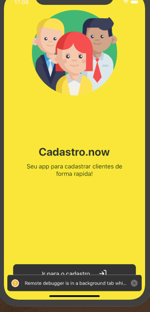
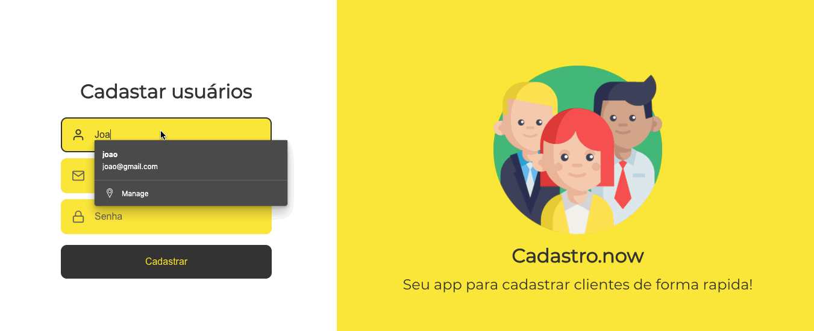
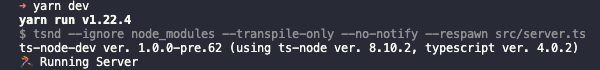

<div align="center">
  
  
</div>  

## :computer: Projeto

Cadastro.now - é uma plataforma simples para cadastro de forma rápida, 
precisando apenas de nome, email e senha.

Um projeto para estudo de monorepo, configurações e como funciona toda organização dos projetos.

## :pushpin: Tecnologias

Esse projeto foi desenvolvido com as seguintes tecnologias:

- [React Native](https://reactnative.dev/)
- [React JS](https://pt-br.reactjs.org/)
- [Unform](https://github.com/Rocketseat/unform)
- [Styled Components](https://styled-components.com/)
- [TypeScript](https://www.typescriptlang.org/)
- [TypeORM](https://www.typescriptlang.org/)
- [Postgres](https://www.typescriptlang.org/)
- [Axios](https://github.com/axios/axios)
- [Yarn Workspaces](https://classic.yarnpkg.com/en/docs/workspaces/)


## :point_down: Executando o projeto

No seu terminal copie e cole ou digite o comando abaixo:

```git
git clone https://github.com/jhonatasmatos/cadastro-now.git
````

Após realizar o clone acesse a pasta do projeto:

```git
cd cadastro-now
````

Logo em seguida digite o comando __*yarn*__ para baixar e atualizar as dependências do projeto  

Para executar o projeto primeiramente inicie o backend, digite em seu terminal o comando:

```terminal
cd packages/backend
````

Já no diretório do backend digite o comando para gerar as tabelas do projeto:  

```terminal
yarn typeorm migration:run
````

*é necessário que você tenha configurado seu banco de dados e*
*alterado as informações do arquivo ormconfig conforme seu banco de dados*

Agora, podemos iniciar o nosso backend, no seu terminal digite:  

```terminal
yarn dev
````

se nao houver erros, você deve ver a seguinte saida:


##Rodando projeto Web

Para rodar o projeto web, navegue até o diretório /web e execute em seu terminal o comando:  

```terminal
yarn start
````

##Rodando projeto Mobile

Para rodar o projeto mobile, navegue até o diretório /mobile e execute em seu terminal o comando:  

Para IOS
```terminal
yarn ios
````

Para Android
```terminal
yarn android
````

---
Feito com coração, café e muito esforço :heart: :rocket: